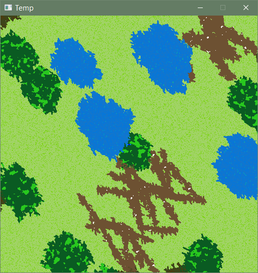
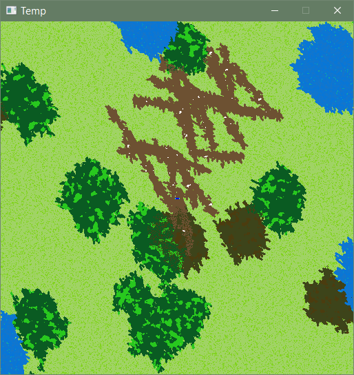

# hpa

Please refer to https://github.com/RichardTang75/hpa/wiki for the design writeup.

This my second attempt at a game, the first being https://github.com/RichardTang75/seamless-generation. I decided to learn and use C++ to get better portability and speed. I've since then redone the algorithm behind the procedural terrain generation and how I tie together the maps. I've been using SDL for the graphics. 

What I have so far are some of the basic building blocks of the game that I'm still working on. These include:

* Using SDL pixel access to create a sort of clipping mask using the pngs in the asset folder as the source images
* Implementing a version of hierarchical pathfinding (map preprocessing) from a paper [https://webdocs.cs.ualberta.ca/~mmueller/ps/hpastar.pdf]. 
* Utilized multithreading for both the terrain generation and the preprocessing. For reference, the python version of map generation took about 45 seconds on average, whereas on -O3 this takes about 8.7 seconds.
* A browser port
* Finished the seamless map creation

Example picture of seamless generation. Four different maps are being displayed here. As evidenced by scrolling down a bit, the maps now completely mesh with one another.

 

A picture of the generated nodes used in HPA. Black dots are entrances and exits, black line represents an example path going from 10,10 to 510, 510.

In progress.

todo:
explore noise, falloffs
use thread pooling
rework path storage
unit AI
pathfinding across multiple maps
cellular noise for nations
zoom
