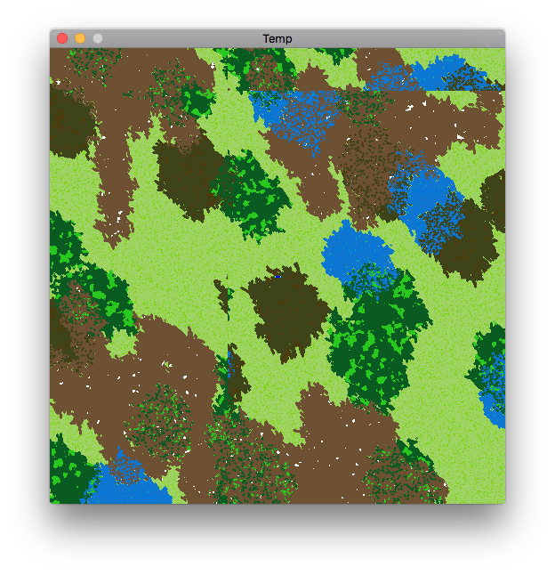
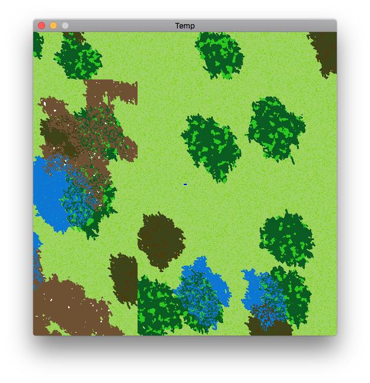
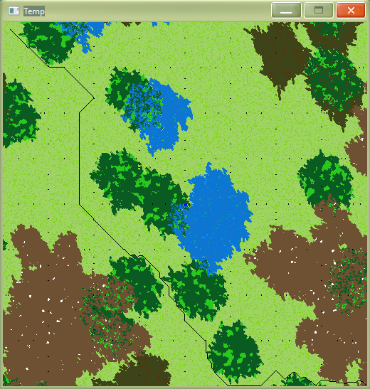

# hpa
Learned and used C++ to build upon Barbaros, speeding up map generation and adding better graphics. 
Refactored the algorithm behind the procedural terrain generation. 
Refactored the algorithm behind updating maps based on neighboring maps for seamlessness for greater accuracy.
Used SDL to modify and draw pictures. Involved SDL pixel access to create a kind of clipping mask to form the image displayed. 
Implemented hierarchical pathfinding (map preprocessing) from a paper [https://webdocs.cs.ualberta.ca/~mmueller/ps/hpastar.pdf]. 
Utilized multithreading for both the terrain generation and the preprocessing. 

Example picture of seamless generation. Four different maps are being displayed here, as evidenced by the slight discrepancies near the top left. There are still some problems to be worked out, but it shows the gist of the idea.

A picture of the nonseamless map generation for purposes of comparison. 

A picture of the generated nodes used in HPA. Black dots are entrances and exits, black line represents an example path going from 10,10 to 510, 510.

In progress.
